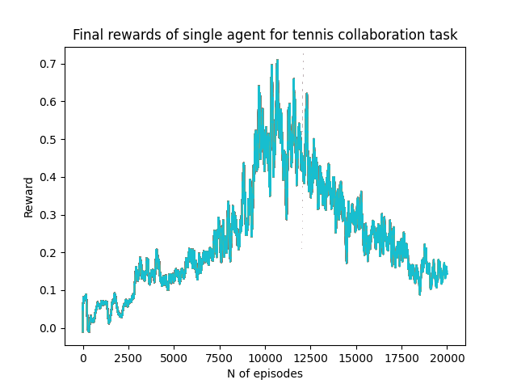
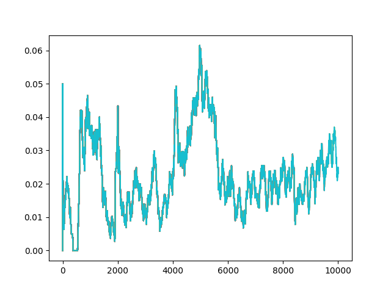

## Algorithm
To solve the Tennis environment task, I tried to use multiple agnet ddpg model (MADDPG) and single agent DDPG with actor-critic mechanism.

###Single agent DDPG
Final model is trained using single agent DDPG algorithm that achieved desired reward df of 0.5 as average over 100 episode. 
Full training could be seen on following chart. Results are an average over 100 episodes, as stated in task description. 




DDPG was trained on a single Agent and trained on CPU only.I used convolutional network with two 
hidden layers of 400 and 300 units for actor and critic, learning rate of actor was set to 1e-4 and 
critic to 1e-3, we used ReplayBuffer to pull sample examples to train network and soft-updated 
that updated target network by some changes in local network. We updated the network after every step we took.

### Multi agent DDPG
Unfortunately, I was unable to make MADDPG to work. After many trials, extensive hyperparameter 
tuning and feature addition. the algorithm still didnt converge to desired reward. best model using MADDPG 
could be seen on following chart:

As you can see, the results were nearly as good as with single agent ddpg. This result was achieved 
after many tens of thousands of episodes, pretrained model and extensive hyperparameter tuning. We 
applied OUNOISE with decreasing noise parameter, prioritized replay buffer with rewards only higher 
than x. We also tried tu tune both actor and critic architectures, both learning rates, soft update 
parameter and discount rate. Unfortunatelly nothing helped the algorithm to get better results. We
believe there is some bug in our code that we just cannot see.


## Navigation
To run the training, edit the hyperparameters in `config.py` and run the script either for single agent DDPG
```python
python main_singleagent.py
```
or multi agnet ddpg
```python
python main.py
```
DDPG algorithm is written in `ddpg.py` and multiagent network with ddpg algorithm is in `maddpg_tennis.py`.

Final model is saved in `results/maddpg/episode-4999.pt`. In this folder we can find trained model, hyperparameters used with trained model and final graph depicting the training.
Model is trained from single-agent ddpg algorithm, as we unfortunatelly couldnt find a way to make multiple agent DDPG to work. 

All config values are set in `config.py` module.

To simply evaluate the results and see tennis agent perform, run
```python 
python evaluation.py --n-episode 10
```
To see the agent perform on 10 episodes.

Repo also contains `workspace_udacite` that served as a baseline for our maddpg algorithm, but is not use in any way in final model.

Final algorithm is further described in REPORT.md
## Hyperparameters
All hyperparameter values are stored in `results/ddpg/config_params.json`

##Trials
We performed extensive hyperparameter tuning with MADDPG algorithm. After tuning learning rate of 
both actor and critic, network architecture and number of layers, tau and gamma parameter, we 
decided to use only singlie agent DDPG that worked flawlessly on first try. We hope to get back
to this task later in the future and solve it with MADDPG as well.
